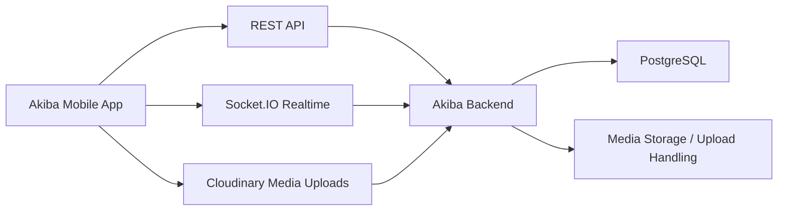

# Akiba Mobile

[](https://expo.dev/)
[](https://reactnative.dev/)
[](https://www.typescriptlang.org/)
[](https://docs.expo.dev/build/introduction/)

Akiba Mobile is a mobile-first group savings and financial collaboration app built with React Native, Expo Router, and TypeScript.
It is the client application for creating spaces, managing memberships, recording contributions, requesting withdrawals, chatting in real time, and receiving notifications.

## Project Overview

This repository contains the Akiba mobile app used by members, admins, and creators to:

- authenticate into the platform
- create and join savings spaces
- track contributions and balances
- manage space members and leadership roles
- request and approve withdrawals
- chat inside each space
- receive push and in-app notifications
- manage profile settings and account preferences

The app uses Expo Router for file-based navigation, Zustand for local session/state management, Axios for API access, Socket.IO for realtime updates, and Expo services for notifications, secure storage, image picking, and native device integration.

## Core Features

- Email/phone-style authentication flows with session restore
- Onboarding and invite-link handling
- Home dashboard with summaries and quick actions
- Spaces list, creation, detail, summaries, transactions, members, settings, and withdrawals
- Member role management for creators, admins, and members
- Contribution and deposit entry flows
- Withdrawal request flow with governance checks
- Space chat with realtime presence and message reactions
- Push notifications and notification inbox
- Profile editing, notification preferences, help, privacy, terms, and account deletion

## Technology Stack

- **Framework:** Expo SDK 54, React Native 0.81, Expo Router
- **Language:** TypeScript
- **State:** Zustand
- **Networking:** Axios
- **Realtime:** Socket.IO client
- **Storage:** AsyncStorage and Expo SecureStore
- **Native capabilities:** Expo Notifications, Image Picker, Contacts, Clipboard, Sharing, Haptics, Media Library
- **UI utilities:** Safe area context, React Navigation, SVG, chart-kit, reanimated

## Project Structure

```text
frontend/
├─ app/                  # Expo Router screens and layouts
│  ├─ (auth)/            # Login, register, password reset
│  ├─ (drawer)/          # Authenticated shell and drawers/tabs
│  ├─ invite/            # Invite landing and join flows
│  └─ onboarding.tsx
├─ components/           # Shared UI components
├─ hooks/                # Theme and color-scheme helpers
├─ services/             # API-facing service modules
├─ src/                  # App logic, stores, services, utilities
├─ shared/               # Shared DTOs and governance helpers
├─ constants/            # Theme and constant values
├─ utils/                # API client and linking helpers
├─ assets/               # Icons, splash assets, images
└─ eas.json / app.json   # Expo and EAS configuration
```

The app uses the `@shared/*` alias for shared contracts and governance helpers that are consumed from the backend repo's shared module.

## Architecture



### Spaces

Spaces are the primary collaboration unit. A space contains members, contributions, withdrawals, chat, summaries, and notification preferences.

### Membership Roles

- **Creator**: owns the space and controls governance actions
- **Admin**: helps approve withdrawals and manage the space
- **Member**: participates in savings and collaboration

### Contributions

Contribution and deposit flows are surfaced in space screens and summaries. The UI delegates transaction creation to the backend and then refreshes balances, charts, and pending states from the API.

### Withdrawals

Withdrawal requests are displayed in the transactions area with governance-aware UI state. The creator can initiate withdrawals only when the backend says the space is eligible. Admin approvals, rejections, and cancellation actions are driven from the transactions screen and reflected in the summary views.

### Chat

Each space has a dedicated chat screen with realtime message delivery, typing indicators, reactions, message reads, and presence updates. The app connects to the backend Socket.IO server after authentication.

### Notifications

Notifications are shown in-app and can also be delivered through push registration. The app hydrates notifications from the backend and listens for realtime notification events over Socket.IO.

## Environment Setup

### Prerequisites

- Node.js 20+
- npm
- Expo CLI / EAS CLI
- Android Studio for Android builds
- Xcode for iOS builds on macOS
- A running Akiba backend instance

### Environment Variables

Create `frontend/.env` for local development and `frontend/.env.production` for release builds.

Required variables:

- `EXPO_PUBLIC_API_URL` - backend base URL
- `EXPO_PUBLIC_WS_URL` - Socket.IO / websocket URL
- `EXPO_PUBLIC_CLOUDINARY_CLOUD_NAME` - Cloudinary cloud name for media uploads
- `EXPO_PUBLIC_CLOUDINARY_UPLOAD_PRESET` - Cloudinary upload preset for signed-less uploads

Optional variables:

- `EXPO_PUBLIC_DEBUG_API_LOGS` - enables verbose API logging in development

The app reads these values through Expo's public environment-variable mechanism, so they must be available at bundle time for local builds and production APK/IPA builds.

## Running Locally

```bash
npm install
npm run start
```

Useful commands:

```bash
npm run android
npm run ios
npm run web
npm run lint
```

## Building for Android and iOS

This repository uses EAS Build profiles defined in `frontend/eas.json`:

- `development` — development client build
- `preview` — internal distribution build
- `production` — production build with auto-increment enabled

Example commands:

```bash
npx eas build --platform android --profile production
npx eas build --platform ios --profile production
```

For iterative native testing, use the `development` profile to generate a development client build.

## Authentication Architecture

Authentication is handled with:

- an auth store that persists the session
- secure storage for tokens and session restoration
- Expo Router guards in the root layout
- automatic session hydration on app launch
- push registration after sign-in

The root layout restores the session, hydrates onboarding state, resolves invite links, and then routes the user into the authenticated shell or the login flow.

## Space Architecture

Space data is organized around:

- space metadata and invitation flow
- membership lists and admin role management
- summaries and charts
- deposit and withdrawal transaction views
- member settings and governance controls

The current screen hierarchy includes:

- `home`
- `spaces`
- `profile`
- space detail screens for `transactions`, `summaries`, `members`, `chat`, `settings`, `deposit`, `withdraw`, and `invite/contacts`

## Chat and Notifications Architecture

### Chat

- `socket.io-client` connects the app to the backend realtime server
- space chat screens subscribe to message, typing, reaction, and presence updates
- chat state is coordinated through app stores and API service calls

### Notifications

- Expo Notifications is used for native push registration
- notification state is hydrated from the backend API
- realtime notification events are received over the websocket connection
- in-app notification pages present the notification feed and read state

## Development Conventions

- Keep screen logic in the `app/` route tree and shared UI in `components/`
- Put API calls in `services/` rather than in screens
- Reuse the shared DTOs from `shared/` instead of duplicating contracts
- Prefer TypeScript types from the shared contract layer for request/response payloads
- Use Zustand stores for cross-screen session and UI state
- Keep navigation, route params, and URL handling aligned with Expo Router
- Run linting before merging changes

## Contribution Guidelines

- Make focused changes that match the existing architecture
- Update shared contracts when API payloads change
- Keep frontend and backend changes in sync
- Avoid introducing new patterns when an existing service or store already solves the problem
- Run `npm run lint` and a native or simulator smoke test before opening a pull request
- Document any new environment variables or build steps in this file

## Related Repository

Backend: [https://github.com/aogajoseph/akiba-backend](https://github.com/aogajoseph/akiba-backend)
